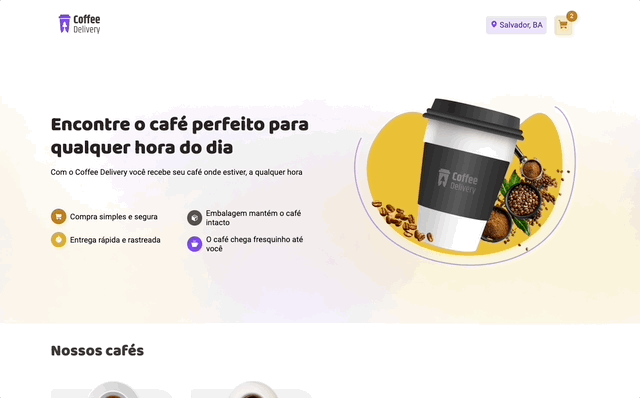
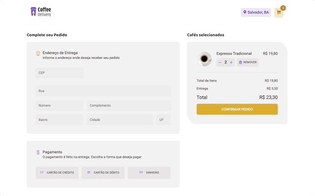

<h1 align="center">Site de Delivery de Cafés</h1>

Criação de uma aplicação para delivery de café com contexto de carrinho e preenchimento do endereço automático utilizando a API Via Cep. O projeto foi para fins de estudos mas está preparado facilmente para ser implementado em ambiente real de produção.

  <h3> 🚧 Produção 🚀 </h3>
  <strong><a href="https://coffee-delivery-ashen.vercel.app/" target="_blank">🔗 Visualize o projeto clicando aqui</a></strong>

# Sumário
-[Funcionalidades](#funcionalidades)  
-[Imagens](#imagens) 
-[Tecnologias](#tecnologias) 

# Funcionalidades
- [x] Showcase de produtos na página principal
- [x] Poder adicionar várias quantidades de 01 produto ao carrinho ainda no showcase
- [x] Carrinho de produtos com contexto global
- [x] Cálculo do Resumo e do Preço Total no carrinho já com o frete
- [X] Edição do carrinho (editar a quantidade do produto ou removê-lo)
- [X] Após preenchimento do CEP, o endereço é preenchido automaticamente consumindo API ViaCep
- [X] Página de Confirmação do Pedido com os dados em contexto preenchidos na página de carrinho
- [ ] Responsividade para Mobile - (em desenvolvimento)

# Imagens

# Tecnologias
As ferramentas utilizadas foram:
<ul style="list-style: none">
  <li>React com o Vite</li>
  <li>Typescript</li>
  <li>Context API</li>
  <li>Axios</li>
  <li>Phosphor Icons</li>
  <li>React Router</li>
  <li>Styled Components</li>
</ul>

  <h3> 🚧 Produção 🚀 </h3>
  <strong><a href="https://coffee-delivery-ashen.vercel.app/" target="_blank">🔗 Visualize o projeto clicando aqui</a></strong>

# Autor

<a href="https://github.com/devalexsantos">Alex Santos</a>

